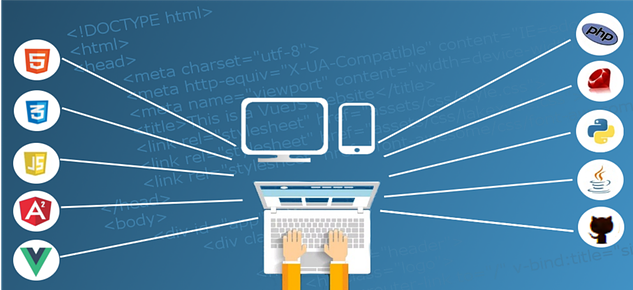

# Desarrollo web en entorno servidor

Repositorio principal del módulo DWES

## Resultados de aprendizaje

De acuerdo al Real Decreto 686/2010, de 20 de mayo de 2010, y actualizado en el Real Decreto. 405/2023, de 29 de mayo de 2023 por el que se establece el título de Técnico Superior en Desarrollo de Aplicaciones Web y se fijan sus enseñanzas mínimas, los resultados de aprendizaje a alcanzar con la realización del módulo son:

- RA1: Selecciona las arquitecturas y tecnologías de programación web en entorno servidor, analizando sus capacidades y características propias.
- RA2: Escribe sentencias ejecutables por un servidor web reconociendo y aplicando procedimientos de integración del código en lenguajes de marcas.
- RA3: Escribe bloques de sentencias embebidos en lenguajes de marcas, seleccionando y utilizando las estructuras de programación.
- RA4: Desarrolla aplicaciones web embebidas en lenguajes de marcas analizando e incorporando funcionalidades según especificaciones.
- RA5: Desarrolla aplicaciones web identificando y aplicando mecanismos para separar el código de presentación de la lógica de negocio.
- RA6: Desarrolla aplicaciones web de acceso a almacenes de datos, aplicando medidas para mantener la seguridad y la integridad de la información.
- RA7: Desarrolla servicios web reutilizables y accesibles mediante protocolos web, verificando su funcionamiento.
- RA8: Genera páginas web dinámicas analizando y utilizando tecnologías y frameworks del servidor web que añadan código al lenguaje de marcas.
- RA9: Desarrolla aplicaciones web híbridas seleccionando y utilizando tecnologías, frameworks servidor y repositorios heterogéneos de información.

## Unidades de trabajo

- [UT01: Introducción al DWES. Arquitecturas y tecnologías de programación web]

- [UT02: Programación web con Java (JakartaEE)](https://github.com/profeMelola/DWES-02-2025-26)

- [UT03: Programación web con Spring Framework & Spring Boot]
  
- [UT03: Sesiones y autenticación]
  
- [UT04: Persistencia de datos en aplicaciones web]
  
- [UT05: Servicios Web]

- [UT06: Desarrollo web avanzado. Aplicaciones web híbridas]

  

## Licencia

 Este obra está bajo una <a rel="license" href="http://creativecommons.org/licenses/by-nc-sa/4.0/">licencia de Creative Commons Reconocimiento-NoComercial-CompartirIgual 4.0 Internacional</a>.
